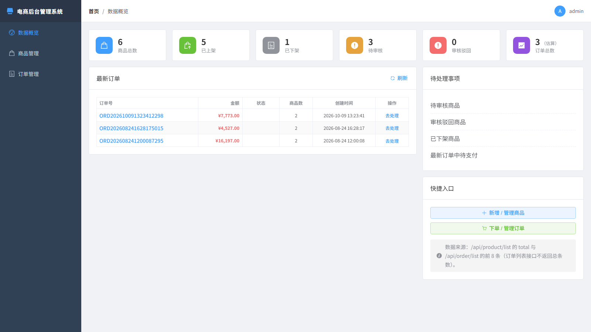
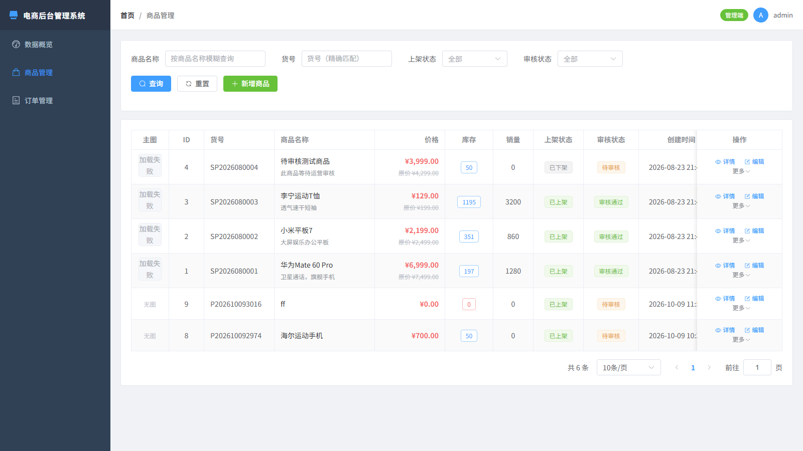
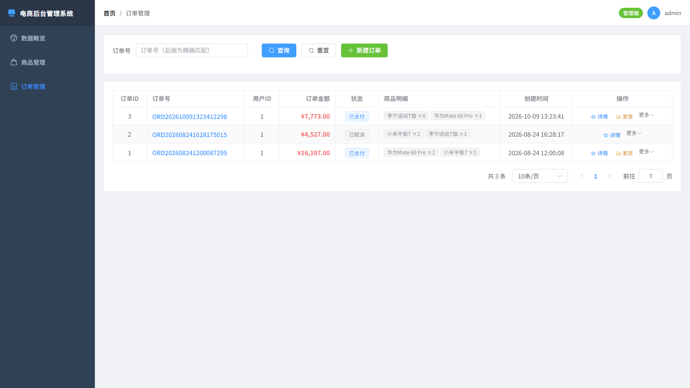

# Mall E-Commerce · 电商平台管理系统

开源电商平台——包含**后台管理系统**与**后端核心服务**两部分。系统支持完整的商品审核上架流程、订单创建支付发货流转，适用于电商场景学习、毕业设计或二次开发。

<div align="center">


</div>

## 目录结构

```
mall-ecommerce/
├── backend/                  # Spring Boot 后端服务
│   ├── pom.xml
│   └── src/main/java/com/mall2/
│       ├── Product/          # 商品模块
│       │   ├── controller/ProductController.java
│       │   ├── service/impl/ProductServiceImpl.java
│       │   ├── model/Product.java
│       │   ├── dto/ProductQueryParam.java
│       │   └── mapper/ProductMapper.xml
│       ├── Order/            # 订单模块
│       │   ├── controller/OrderController.java
│       │   ├── service/Impl/OrderServiceImpl.java
│       │   ├── model/Order.java / OrderItem.java
│       │   ├── dto/CreateOrderDTO.java / OrderVO.java
│       │   └── mapper/*.xml
│       └── common/           # 通用组件
│           ├── CommonResult.java / CommonPage.java
│           └── Exceptions/
├── frontend/                 # Vue 3 管理后台前端
│   ├── package.json
│   ├── vite.config.js
│   └── src/
│       ├── api/              # 接口封装
│       ├── views/            # 页面组件
│       │   ├── dashboard/    # 数据概览
│       │   ├── product/      # 商品管理
│       │   └── order/        # 订单管理
│       ├── layout/           # 布局容器
│       ├── router/           # 路由
│       └── utils/            # 工具函数
├── docs/                     # 项目文档 & 截图
│   └── screenshots/          # 前端界面截图
├── .gitignore                # 全局忽略规则
├── backend/README.md         # 后端服务文档
└── frontend/README.md        # 前端管理端文档
```

## 功能一览

| 模块 | 功能 |
|---|---|
| **商品管理** | 搜索 / 新增 / 编辑 / 详情 / 上架 / 下架 / 审核通过 / 审核驳回 / 逻辑删除 / 富文本详情 |
| **订单管理** | 下单选品 / 支付 / 取消(回补库存) / 发货 / 确认完成 / 修改备注 / 快照明细表 |
| **数据概览** | 商品统计卡 / 最新订单 / 待处理事项 / 快捷入口 |
| **安全机制** | 乐观锁扣减库存 / 审核流 / JSR303 参数校验 / 全局异常处理器 |

完整功能列表请参考：[backend/README.md](backend/README.md) 和 [frontend/README.md](frontend/README.md)

## 技术栈

### 后端

| 技术 | 版本 |
|---|---|
| Spring Boot | 4.0.8 |
| MyBatis | 4.0.1 |
| MySQL Connector | runtime |
| PageHelper | 1.4.7 (分页插件) |
| Hutool | 5.8.40 |
| Lombok | optional |
| Java | 17 |

### 前端

| 技术 | 版本 |
|---|---|
| Vue 3 | ^3.4.31 |
| Vite | ^5.3.3 |
| Element Plus | ^2.14.7 |
| Pinia | ^2.3.1 |
| Vue Router | ^4.6.4 |
| Axios | ^1.20.0 |

## 快速开始

### 环境要求

- JDK 17+
- Maven 3.6+
- Node.js 18+
- MySQL 8.0+

### 1. 启动后端

```bash
cd mall-ecommerce/backend
# 修改 src/main/resources/application.yml 中的数据库连接信息
mvn spring-boot:run
```

### 2. 启动前端

```bash
cd mall-ecommerce/frontend
npm install
npm run dev
```

浏览器打开 `http://localhost:5173` → Vite 自动将 `/api` 请求代理到后端 8080 端口。

### 3. 生产构建

```bash
cd mall-ecommerce/frontend
npm run build          # 输出至 dist/
cd ../backend
mvn clean package -DskipTests   # 输出至 target/mall2-*.jar
```

## 截图展示

### 数据概览（/dashboard）




### 商品管理（/product）




### 订单管理（/order）




> 📸 截图基于 Mock 演示数据生成（1600×900）。若需重新生成：启动后端 + `npm run preview` 后，用无头 Edge 截取即可，例如
> `msedge --headless --disable-gpu --screenshot=dashboard.png --window-size=1600,900 http://localhost:5173/dashboard`

## License

MIT
